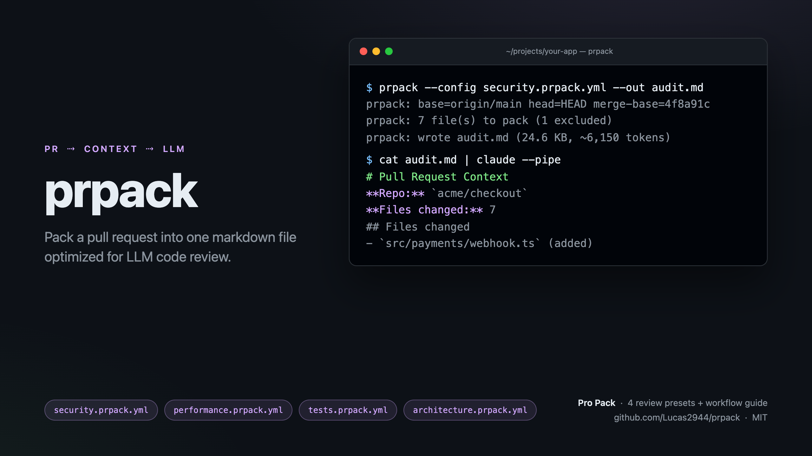

# prpack

[](https://github.com/Lucas2944/prpack/releases/latest)
[](./LICENSE)
[](https://github.com/Lucas2944/prpack-action)

> Pack a pull request into one markdown file optimized for LLM code review.



> **New:** want this to run on every PR automatically? See [prpack-action](https://github.com/Lucas2944/prpack-action) — a GitHub Action wrapper. Drop a 5-line workflow in your repo and you get the packed markdown on every PR.

`prpack` walks the diff between two refs and emits a single, well-structured markdown file containing the commit list, the diff, **and the full post-change contents of every touched file**. Drop it into Claude / Cursor / any model and ask for review — no copy-pasting, no missing context, no per-file back-and-forth.

```sh
$ prpack --out ctx.md
prpack: base=origin/main head=HEAD merge-base=4f8a91c
prpack: 7 file(s) to pack (1 excluded)
prpack: wrote ctx.md (24.6 KB, ~6,150 tokens)
```

Then paste `ctx.md` into your model of choice and ask:

> Review this PR. The diff and full file contents are below. Flag bugs, missing edge cases, and anything that would make a reviewer pause.

That's it.

## Why

> The technique behind prpack is written up at length in [THE_TECHNIQUE.md](./THE_TECHNIQUE.md) — a story of how a missed null-deref taught me that LLM code review is a context-engineering problem, not a model problem.

Asking an LLM to review a PR is the obvious move, but the context it sees matters more than the prompt. Just pasting a diff drops crucial context — the model can't see what the rest of the function looks like, how callers use the changed code, or what the surrounding module exports. Pasting the whole repo wastes tokens and dilutes attention.

`prpack` packs **exactly the diff plus the full state of every file the diff touches**. That's enough context to reason about the change without drowning the model in noise. If you want adjacent test files included automatically, pass `--include-tests`.

## Install

```sh
# One-shot, no install:
npx github:Lucas2944/prpack --out ctx.md

# Or install globally:
npm install -g github:Lucas2944/prpack
prpack --out ctx.md
```

Requires Node 18+ and `git` on PATH.

## Usage

```
prpack [options]

Options:
  --base <ref>          Base ref to diff against (default: origin/main, falls back to main)
  --head <ref>          Head ref (default: HEAD)
  --out <path>          Output file (default: stdout)
  --config <path>       Load preset from a .prpack.yml file
  --include-tests       Include test files even if not changed (auto-discovers siblings)
  --include-untracked   Include untracked files in the diff
  --no-content          Only include the diff, not full file contents
  --max-bytes <n>       Skip files larger than n bytes (default: 200000)
  --exclude <glob>      Exclude paths matching glob (repeatable)
  --quiet               Suppress stderr progress logs
```

### Common recipes

```sh
# Default: pack vs origin/main, write to ctx.md
prpack --out ctx.md

# Diff against a different base
prpack --base develop --out ctx.md

# Pack the last 3 commits even on main
prpack --base HEAD~3 --head HEAD --out ctx.md

# Diff-only, skip full contents (smaller, faster)
prpack --no-content --out ctx.md

# Pull adjacent tests in too
prpack --include-tests --out ctx.md

# Exclude generated/lock files
prpack --exclude 'pnpm-lock.yaml' --exclude 'dist/**' --out ctx.md

# Pipe straight to clipboard (macOS)
prpack | pbcopy

# Use a review preset (see prpack-pro)
prpack --config security.prpack.yml --out audit.md
```

### `.prpack.yml` configs

Drop a YAML file with any of these keys:

```yaml
base: develop
includeTests: true
exclude:
  - dist/**
  - "*.lock"
preface: |
  This PR introduces a new payment flow. Focus on input validation and
  error paths around the Stripe webhook handler.
reviewPrompt: |
  You are a senior engineer reviewing this PR. Flag bugs, missing edge
  cases, and security issues. Quote line numbers when you do.
```

`preface` is added under "Reviewer note from author" near the top. `reviewPrompt` is appended at the end, ready for the model to act on.

## Output shape

```
# Pull Request Context
**Repo:** `org/repo`
**Branch:** `feature/...`
**Base:** `main` → **Head:** `HEAD`
**Commits:** 3
**Files changed:** 7

## Commits
- `abc1234` 2026-05-10 — Add Stripe webhook handler

## Files changed
- `src/payments/webhook.ts` _(added)_
- ...

---
## `src/payments/webhook.ts` _(added)_

### Diff
```diff
...
```

### Full content (post-change)
```ts
...
```
```

Every code block uses a fence longer than any backtick run inside it, so embedded markdown / code samples never break formatting.

## What it doesn't do

- **No network calls.** Everything is local `git`.
- **No AI built in.** `prpack` produces context; you bring the model.
- **No web UI.** It's a single CLI binary.
- **No telemetry.** `prpack` never opens a socket.

## Pro presets

If you want curated `.prpack.yml` configs for specific review styles — security, performance, architecture, test-coverage — plus a one-page workflow guide, see **[prpack Pro Pack](https://scottthurman89.itch.io/prpack)** (free or pay-what-you-want). The CLI is and stays free; the pack is optional.

## License

MIT.
