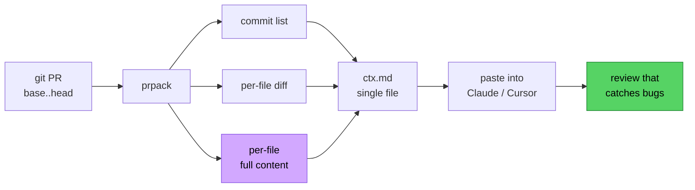

# Your LLM code reviewer is reading half the file

Last month I shipped a bug that a junior dev would have caught in thirty seconds. Claude had reviewed the PR. It said "looks good." The bug was a null-deref two lines outside the diff.

Here's the diff Claude saw:

```diff
@@ -42,7 +42,7 @@ export function formatInvoice(invoice: Invoice) {
-  const total = invoice.lineItems.reduce((s, li) => s + li.amount, 0);
+  const total = sumLineItems(invoice.lineItems);
   return {
     id: invoice.id,
     total,
```

Claude's review: "Good refactor. `sumLineItems` is more readable and easier to test." Fine.

What Claude couldn't see was the rest of `formatInvoice`, where four lines down we did `invoice.customer.email.toLowerCase()`. The pre-refactor code happened to short-circuit on a path that prevented null customers from reaching that line. The refactor broke the short-circuit. The diff was clean. The function was broken.

This is not a Claude problem. This is a context problem. And it took me embarrassingly long to figure out the fix.

## Why this keeps happening

When you paste a diff into a model, you are asking it to reason about a change in isolation. Diffs are designed for humans who already have the file open in an editor. The human reviewer mentally fills in the surrounding code, the call sites, the types, the invariants. The model does none of this. It sees `+` and `-` lines and a few lines of context. That's it.

So the model does the only thing it can: it pattern-matches on the diff itself. "This looks like a refactor. Refactors are usually safe. LGTM." It is not being lazy. It literally cannot see the bug, because the bug lives in lines that didn't change.

Three things the model is almost always missing:

1. **The full post-change file.** Not the diff. The actual file as it will exist after merge.
2. **Callers and types.** Less critical, but ideal.
3. **The reviewer's intent.** What you actually want checked.

You can't easily fix (2) and (3) without a much bigger system. But (1) is free. You just have to assemble it.

## The minimum viable fix

For every file the PR touches, give the model:

- The commit list (so it knows the story you're telling)
- The diff (so it knows what changed)
- The full post-change content of the file (so it can see what didn't change but matters)

That's it. That single addition — full file content — is what turns useless reviews into reviews that catch real bugs. I have run this experiment maybe forty times now on my own PRs. The hit rate on substantive feedback goes from roughly one in five to roughly four in five.

Visually:



The purple step — full content — is the one that flips the outcome.

The annoying part is assembling it. You have to `git diff base..head --name-only`, loop through each file, `cat` it, slap on the diff, format the whole thing so the model doesn't choke on nested code fences. I did this by hand twice and then wrote a script. The script grew. I cleaned it up and put it on GitHub.

## prpack

[prpack](https://github.com/Lucas2944/prpack) is a Node CLI that does exactly this and nothing else. Zero dependencies, MIT licensed, requires Node 18 and `git`.

```sh
npx github:Lucas2944/prpack --out ctx.md
```

That command walks the diff between `origin/main` and `HEAD`, and writes a single markdown file containing:

- Repo and branch metadata, base/head refs, commit count, files changed
- The commit list with dates
- For every touched file: the per-file diff plus the full post-change content
- Fence markers chosen to be longer than any backticks embedded in your code, so the markdown doesn't break

You paste `ctx.md` into Claude or Cursor or whatever model you use. Then you ask for a review.

Here's what a useful follow-up prompt looks like:

```
Review this PR. Pay attention to:
- nullability / undefined handling
- changes to error paths
- assumptions the new code makes about callers

Be specific. Cite file and line. If you're unsure, say so.
```

And here's the kind of feedback I now get back, on the same invoice refactor from the top of this post:

> In `formatInvoice` (src/invoice.ts:48), after the refactor to `sumLineItems`, the function unconditionally accesses `invoice.customer.email`. Previously the `.reduce` on `lineItems` returned early on the empty-array path, which masked cases where `invoice.customer` is null (seen at the call site in `src/jobs/billing.ts:112`). Recommend guarding `invoice.customer` explicitly.

That is a real review. It would not exist if the model had only seen the diff.

## Tuning for big PRs

Full file content is fantastic until your PR touches forty files and you blow through the context window. prpack has a few flags for this.

```sh
# Skip full file contents, ship only the diff
npx github:Lucas2944/prpack --no-content --out ctx.md

# Exclude generated or vendored paths (repeatable)
npx github:Lucas2944/prpack \
  --exclude 'dist/**' \
  --exclude '**/*.snap' \
  --exclude 'pnpm-lock.yaml' \
  --out ctx.md

# Cap per-file size (default 200000 bytes)
npx github:Lucas2944/prpack --max-bytes 50000 --out ctx.md
```

My usual workflow for a big PR: first pass with `--no-content` to get a high-level architectural review, then a second pass on just the files the first review flagged, this time with full content. Two prompts, both fit comfortably in context, and the model gets to focus.

A few other flags worth knowing:

- `--base <ref>` and `--head <ref>` if you're not reviewing against `origin/main`
- `--include-tests` to pull in adjacent test files even if they didn't change
- `--include-untracked` for reviewing local work-in-progress before you commit it

That last one is genuinely my most-used flag. I run prpack on uncommitted work, paste it in, and ask "what am I missing" before I even open a PR.

## Review presets

The thing I noticed after using this for a couple months: a single review prompt is never as good as four focused ones. "Review this code" gets you mush. "Review this code for SQL injection, hardcoded secrets, and missing auth checks" gets you a security review.

So I built a small set of preset configs — security, performance, tests, architecture — that you load with `--config`. Each preset is a `.prpack.yml` that pre-tunes the context (which files to include, what to exclude, what to ask) for one review angle. Running all four in sequence on a meaningful PR takes about five minutes and consistently turns up things one general review would have missed.

I packaged these presets plus a short workflow guide as a separate pay-what-you-want download (free if you want it free) on [itch.io](https://scottthurman89.itch.io/prpack). The CLI itself is and will stay MIT. The presets are optional; you can write your own `.prpack.yml` in ten minutes once you've seen one.

The four angles, in case you want to roll your own:

- **Security** — auth, input validation, secrets, injection, deserialization
- **Performance** — N+1s, allocations in hot paths, unnecessary work, cache invalidation
- **Tests** — coverage gaps, brittle assertions, missing edge cases
- **Architecture** — coupling, layering violations, abstractions that leak

The trick is not the prompts. The trick is running them separately so the model isn't trying to do four things at once.

## What this is really about

The lesson from all of this, for me, is that LLM code review is mostly a context-engineering problem, not a model problem. The models are already good enough. They will reliably catch a category of bugs that humans miss when they have the same eyes-glazed-over PR-review fatigue we all have at 4pm on a Friday. But they need the same thing a human reviewer needs: enough surrounding code to reason about what didn't change.

Diffs alone don't cut it. Full file content is the cheapest, highest-leverage thing you can add. Everything else — call graphs, type info, intent — is gravy.

prpack is one tool that does this. You don't need prpack. You can write the equivalent in fifty lines of bash. The point is just: stop pasting raw diffs.

If you try it and it breaks on your repo, or you have ideas for flags I should add, open an issue or PR on the repo. I read everything.

## Three ways to use it

- **CLI**, in your terminal: `npx github:Lucas2944/prpack --out ctx.md` ([repo](https://github.com/Lucas2944/prpack))
- **GitHub Action**, on every PR automatically: drop `uses: Lucas2944/prpack-action@v1` into a 5-line workflow ([repo](https://github.com/Lucas2944/prpack-action))
- **Browser demo**, to try it on someone else's PR without installing anything: paste a URL at [lucas2944.github.io/prpack-demo](https://lucas2944.github.io/prpack-demo/)

Same output format for all three — copy/paste-ready for whatever model you use.

## Update: native review mode

v0.2.0 adds `prpack --review`, which keeps the original pack-first workflow but can now send the packed context directly to Anthropic's Messages API and stream the review back in the terminal. The four focused angles from `prpack-prompts` are built in: security, performance, tests, and architecture. There is also a general review mode for a balanced pass.

This does not replace the human-in-the-loop workflow. It just removes the copy/paste step when you already know you want Claude to review the packed context. prpack still prints the cost estimate before the call, and `--out ctx.md` still gives you the artifact to inspect or reuse.
